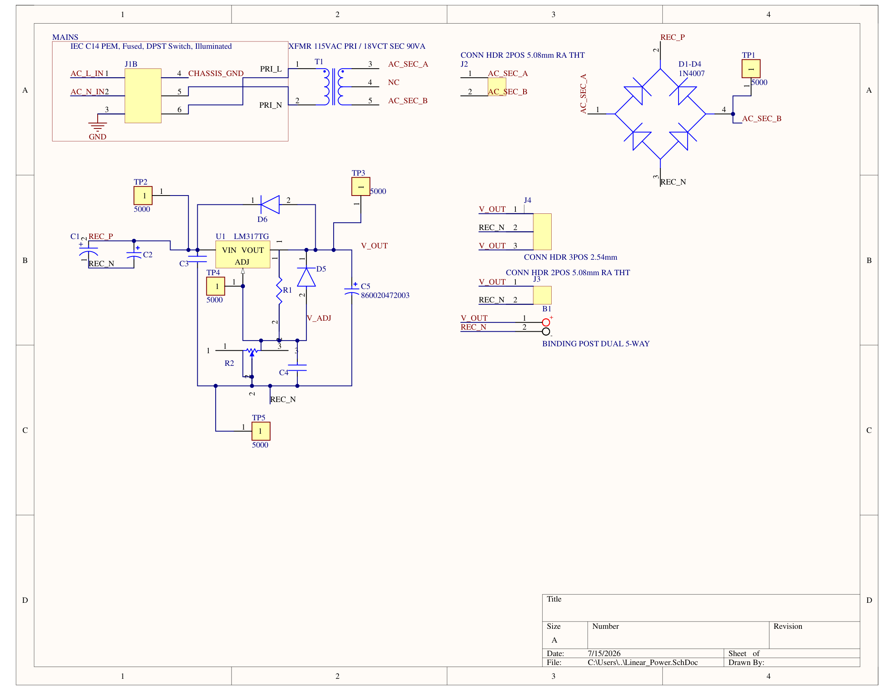

# Variable Linear Bench Power Supply

A fully enclosed variable linear bench power supply designed from schematic 
through PCB layout and physical assembly. Output is adjustable from 
approximately 1.5V to 21V DC at up to 1A continuous. Built as an independent 
hardware project to develop practical PCB design, analog circuit design, and 
enclosure build skills.

---

## Specifications

| Parameter | Value |
|---|---|
| Input | 120V AC mains |
| Output Voltage | ~1.5V to ~21V DC adjustable |
| Output Current | 1A continuous |
| Regulation | LM317T linear regulator |
| Transformer | Hammond 166L18 — 18V AC secondary |
| PCB | 2-layer, 1oz copper, JLCPCB fabrication |
| Enclosure | Grounded steel chassis |

---

## Project Overview

This project covers the full hardware development cycle for a benchtop 
linear power supply. The design intent was to build a genuinely usable 
piece of bench equipment rather than a simplified kit — including proper 
mains isolation, a grounded metal enclosure, panel instrumentation, and 
pluggable wire-to-board connectors for serviceability.

The regulation circuit is built around the LM317T adjustable linear 
regulator. Output voltage is set by a panel-mount potentiometer driving 
the feedback divider network. Protection diodes are included per the 
LM317 datasheet recommendations to prevent damage from capacitor discharge 
under fault conditions.

---

## Design Decisions

**Transformer selection**

An 18V AC secondary transformer was chosen over a 24V secondary to manage 
LM317 thermal dissipation. A 24V secondary rectifies to approximately 30V DC, 
creating worst-case dissipation of nearly 28W at minimum output voltage and 
1A load — beyond what a practical heatsink arrangement can handle. The 18V 
secondary rectifies to approximately 22-24V DC, limiting worst-case 
dissipation to approximately 22W and giving a practical output ceiling 
of 20-21V.

**Thermal management**

Rather than a conventional PCB-mount heatsink, the LM317 is mounted directly 
to the steel enclosure wall via an insulating washer and nylon bushing. The 
enclosure acts as a distributed heatsink with significantly lower thermal 
resistance than any small clip-on heatsink. Ventilation slots are included 
in the enclosure top and bottom panels to enable natural convection airflow.

**Connector strategy**

J2 (transformer secondary input) and J3 (DC output) use OnShore Technology 
pluggable wire-to-board connectors at 5.08mm pitch. This allows the PCB to 
be removed from the enclosure without desoldering any wires — an important 
serviceability consideration for bench equipment that may need repair or 
modification.

**Grounding scheme**

Mains earth ground connects from the IEC power entry module to a grounding 
lug bolted directly to the enclosure wall with a star washer biting through 
any surface coating. Circuit signal ground connects to the enclosure at a 
single point only, near the output binding posts. The LM317 heatsink tab — 
which is electrically connected to the output pin, not ground — is isolated 
from the enclosure wall by an insulating mica washer and nylon shoulder 
bushing.

---

## Schematic

[Download full resolution PDF](docs/schematic.pdf)

---

## PCB Layout

---

## Bill of Materials

Full BOM available as [CSV](docs/bom.csv)

Key components:

| Reference | Part | Value | Manufacturer |
|---|---|---|---|
| U1 | LM317T | Adjustable regulator | Texas Instruments |
| T1 | Hammond 166L18 | 18V 2A transformer | Hammond |
| D1-D4 | 1N4007 | Bridge rectifier | Various |
| C1 | Electrolytic | 2200uF 35V | Würth Elektronik |
| MOD1 | 719W-UEL3BR51 | IEC inlet + switch + fuse | Qualtek |
| J2, J3 | OSTOQ025451 | 2-pos pluggable header | OnShore Technology |

---

## Build Photos

### Bare PCB

### Populated Board

### Completed Build

---

## Test Results

| Output Voltage Set | Measured Output | Ripple (mV p-p) |
|---|---|---|
| 5.0V | | |
| 12.0V | | |
| 18.0V | | |

*To be completed after assembly and testing*

---

## What I Would Change in Revision 2

*To be completed after build and testing — this section will document 
layout errors, component issues, and improvements identified during 
physical assembly and debug.*

---

## Tools Used

- Altium Designer (schematic capture and PCB layout)
- SPICE simulation (circuit verification)
- JLCPCB (PCB fabrication)
- Rigol DS1054Z (output ripple measurement)
- Fluke multimeter (voltage verification)

---

## References

- LM317T Datasheet — Texas Instruments
- Hammond 166 Series Datasheet
- IPC-2221 Generic Standard on Printed Board Design
- Saturn PCB Design Toolkit (trace width calculations)
