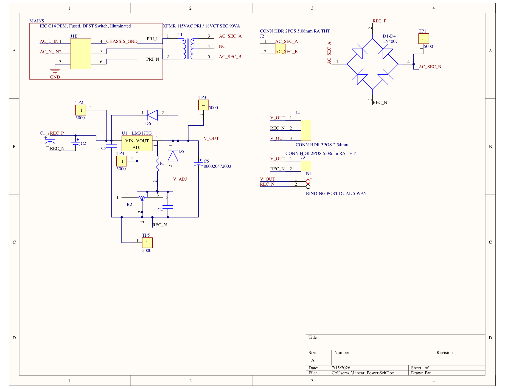

# Variable Linear Bench Power Supply

A fully enclosed variable linear bench power supply designed from schematic 
through PCB layout and physical assembly. Output is adjustable from 
approximately 1.5V to 21V DC at up to 1A continuous. Built as an independent 
hardware project to develop practical PCB design, analog circuit design, and 
enclosure build skills.

---

## Specifications

| Parameter | Value |
|---|---|
| Input | 120V AC mains |
| Output Voltage | ~1.5V to ~21V DC adjustable |
| Output Current | 1A continuous |
| Regulation | LM317T linear regulator |
| Transformer | Hammond 166L18 — 18V AC secondary |
| PCB | 2-layer, 1oz copper, JLCPCB fabrication |
| Enclosure | Grounded steel chassis |

---

## Project Overview

This project covers the full hardware development cycle for a benchtop 
linear power supply. The design intent was to build a genuinely usable 
piece of bench equipment rather than a simplified kit, including proper 
mains isolation, a grounded metal enclosure, panel instrumentation, and 
pluggable wire-to-board connectors for serviceability.

The regulation circuit is built around the LM317T adjustable linear 
regulator. Output voltage is set by a PCB-mount potentiometer driving 
the feedback divider network. Protection diodes are included per the 
LM317 datasheet recommendations to prevent damage from capacitor discharge 
under fault conditions.

---

## Design Decisions

**Transformer selection**

An 18V AC secondary transformer was chosen over a 24V secondary to manage 
LM317 thermal dissipation. A 24V secondary rectifies to approximately 30V DC, 
creating worst-case dissipation of nearly 28W at minimum output voltage and 
1A load — beyond what a practical heatsink arrangement can handle. The 18V 
secondary rectifies to approximately 22-24V DC, limiting worst-case 
dissipation to approximately 22W and giving a practical output ceiling 
of 20-21V.

**Thermal management**

A dedicated PCB-mount heatsink was selected for the LM317 after the enclosure wall-mounting approach orignally considered proved mechanically incompatible with the final  PCB and enclosure layout. The selected heatsink is the Aavid 52902B00000G. A bolt-on TO-220 aliumium fin heatsink with a thermal resistance of 3.7°C/W, 1.5" fin height, black anodized finish, mounted vertically at board level.

At worst case operating conditions, approximately 24V DC rail, 1.5V output, 1A load. Power dissipation across the LM317 reaches 22.5W, which would drive junction temperature beyond the 150°C maximum. At more typical bench supply operating points the thermal performance is acceptable: at 12V output and 500mA load, dissipation is 6W and junction temperature stays below 90°C with 25°C ambient.

The practical implication is that output current capability at low output voltages is thermally limited rather than regulator-limited. At 1.5V output the supply can sustain approximately 300-400mA continuously before approaching the thermal limit. At 12V output and above the full 1A rating is available. This is an accepted tradeoff for a linear bench supply — the wide input-to-output voltage differential inherent in linear regulation creates unavoidable thermal stress at the low end of the adjustment range. The insulating mica washer and nylon shoulder bushing between the LM317 tab and heatsink are required because the TO-220 tab is electrically connected to the output pin, not ground — direct contact with any grounded metal surface would short the output.

**Connector strategy**

J2 (transformer secondary input) and J3 (DC output) use OnShore Technology 
pluggable wire-to-board connectors at 5.08mm pitch. This allows the PCB to 
be removed from the enclosure without desoldering any wires — an important 
serviceability consideration for bench equipment that may need repair or 
modification.

**Grounding scheme**

Mains earth ground connects from the IEC power entry module to a grounding 
lug bolted directly to the enclosure wall with a star washer biting through 
any surface coating. Circuit signal ground connects to the enclosure at a 
single point only, near the output binding posts.The LM317 heatsink tab requires special attention regardless of mounting approach — the TO-220 tab is electrically connected to the output pin, not ground. A mica insulating washer and nylon shoulder bushing are installed between the LM317 tab and the Aavid 529802B00000G heatsink body, with thermal paste on both interfaces to minimize added thermal resistance. Without this isolation the heatsink would sit at output voltage rather than at a floating or ground potential — a shock hazard if the heatsink contacts any grounded metal surface inside the enclosure. The nylon bushing additionally isolates the mounting screw from the tab to complete the isolation.

---

## Schematic

[Download full resolution PDF](docs/schematic.pdf)

---

## PCB Layout

---

## Bill of Materials

Full BOM available as [CSV](docs/bom.csv)

Key components:

| Reference | Part | Value | Manufacturer |
|---|---|---|---|
| U1 | LM317T | Adjustable regulator | Texas Instruments |
| T1 | Hammond 166L18 | 18V 2A transformer | Hammond |
| D1-D4 | 1N4007 | Bridge rectifier | Various |
| C1 | Electrolytic | 2200uF 35V | Würth Elektronik |
| MOD1 | 719W-UEL3BR51 | IEC inlet + switch + fuse | Qualtek |
| J2, J3 | OSTOQ025451 | 2-pos pluggable header | OnShore Technology |

---

## Build Photos

### Bare PCB

### Populated Board

### Completed Build

---

## Test Results

| Output Voltage Set | Measured Output | Ripple (mV p-p) |
|---|---|---|
| 5.0V | | |
| 12.0V | | |
| 18.0V | | |

*To be completed after assembly and testing*

---

## What I Would Change in Revision 2

In a future revision of this project, the primary improvement would be to the thermal management strategy. As noted in the thermal management section, the original design intent was to mount the LM317 directly to a chassis side panel, using the enclosure itself as a distributed heatsink for improved thermal dissipation. This approach proved mechanically incompatible with the final PCB layout and was replaced with a PCB-mount heatsink. A future redesign would resolve this from the start positioning the LM317 at the board edge specifically to accommodate chassis wall mounting, and incorporating ventilation slots or a low-profile fan system in the side panels to further improve airflow and overall thermal performance.

Additionally, a future revision would draw inspiration from the Wanptek DPS3010U bench supply, specifically its digital display interface, USB-C and USB-A output compatibility, and coarse and fine voltage adjustment controls. These features would significantly improve the usability of the supply as a day-to-day bench instrument.

---

## Tools Used

- Altium Designer (schematic capture and PCB layout)
- SPICE simulation (circuit verification)
- JLCPCB (PCB fabrication)
- Rigol DS1054Z (output ripple measurement)
- Fluke multimeter (voltage verification)

---

## References

- LM317T Datasheet — Texas Instruments
- Hammond 166 Series Datasheet
- IPC-2221 Generic Standard on Printed Board Design
- Saturn PCB Design Toolkit (trace width calculations)
